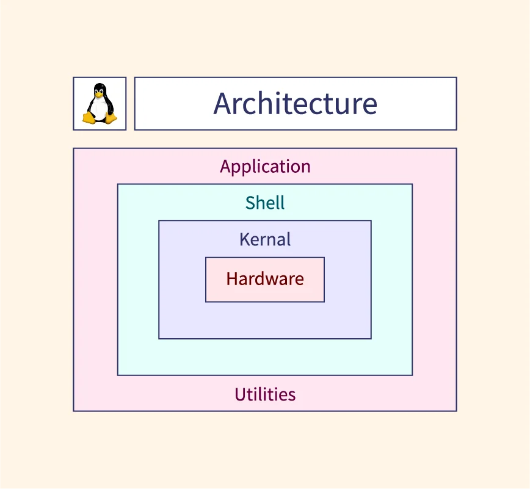
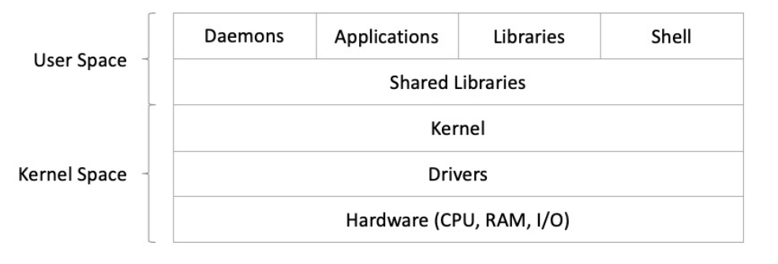

# 🐧 Introduction to Linux and Operating Systems

## 📌 What is an Operating System?

An **Operating System (OS)** is system software that acts as an intermediary between hardware and the user. It manages computer hardware and provides essential services for computer programs.

### Functions of an OS:
- Process Management
- Memory Management
- File System Management
- Device Control
- Security & Access Control
- User Interface

---

## 🐧 What is Linux?

**Linux**  is a relatively modern operating system created in 1991 by **Linus Torvalds**, a Finnish computer
science student from Helsinki. Originally released as a free and open source platform prohibiting
commercial redistribution, Linux eventually adopted the **GNU General Public Licensing (GPL)**
model in 1992. This move played a significant role in its wide adoption by the developer community
and commercial enterprises alike. It is important to note that the Free Software Foundation
community distinctly refers to Linux operating systems (or distributions) as **GNU/Linux** to
emphasize the importance of GNU for free software.

A Linux operating system is typically referred to as a **distribution**. A Linux distribution, or **distro**, is
the installation bundle (usually an ISO image) of an operating system that has a collection of tools,
libraries, and additional software packages installed on top of the **Linux kernel**. A **kernel** is the core
interface between a computer’s hardware and its processes, controlling the communication between
the two and managing the underlying resources as efficiently as possible.

### Key Features of Linux:
- Open Source & Free
- Multitasking & Multi-user
- High Security & Stability
- Customizable
- Strong Community Support

---

## 🧱 Linux vs Other Operating Systems

| Feature            | Linux            | Windows         | macOS           |
|--------------------|------------------|------------------|------------------|
| License            | Open Source (GPL)| Proprietary      | Proprietary      |
| Cost               | Free             | Paid             | Paid             |
| Customization      | High             | Low              | Low              |
| Security           | High             | Moderate         | High             |
| Command Line       | Powerful         | Limited          | Moderate         |
| Usage              | Servers, DevOps  | Desktop/Gaming   | Creative/Design  |

---

## 🧩 Components of a Linux OS

1. **Kernel** – Core of the OS, manages hardware
2. **Shell** – Command-line interface (e.g., Bash)
3. **File System** – Organizes data in directories/files
4. **User Space** – Applications and user tools
5. **Daemons** – Background processes and services

---

## 🐧 Architecture of Linux OS

> 📚 **Source:** [Scaler Topics – Linux Architecture](https://www.scaler.com/topics/linux-architecture/)

---

## 🔧 Linux Kernel – High-Level Diagram

---

## 🏗️ Popular Linux Distributions (Distros)

Linux isn't a single OS – it's a family of **distributions** built around the Linux kernel. Some of the most common are:

- **Ubuntu** – Beginner-friendly, based on Debian
- **Debian** – Stable and secure
- **Fedora** – Cutting-edge, backed by Red Hat
- **CentOS / RHEL** – Enterprise-grade
- **Arch Linux** – Rolling release, DIY philosophy
- **Kali Linux** – Security-focused

One of the key differences among Linux distributions is the **package management system** they use
and the related **Linux package format**.

---

## 📦 Linux in the Real World

- **Servers**: Apache, Nginx, MySQL
- **DevOps**: Containers (Docker), CI/CD
- **Cloud**: AWS, GCP, Azure
- **Security**: Pen-testing, firewall management
- **Desktops**: Lightweight alternatives to Windows

---

## 💡 Why Learn Linux?

- Essential for system administrators, DevOps, cybersecurity, and developers
- Powers over 96% of the top 1 million web servers
- High demand in job markets
- Mastering Linux gives you full control over your systems

---

## 🔗 Resources

- 📘 [The Linux Command Line - William Shotts](https://linuxcommand.org/tlcl.php)
- 🎓 [Linux Journey](https://linuxjourney.com/)
- 🐧 [Ubuntu Manual](https://ubuntu-manual.org/)
- 💬 [r/linux (Reddit)](https://www.reddit.com/r/linux/)

---

> 🧠 **Next Topic**: [Linux Installation Guide](02_installation_guide.md)
